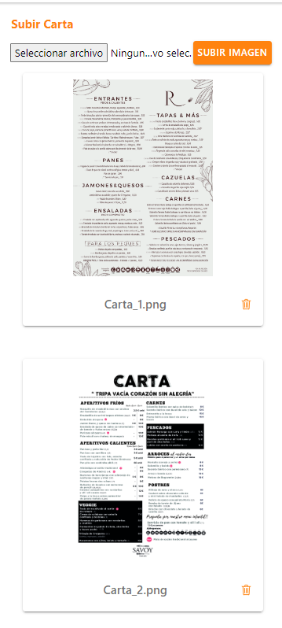
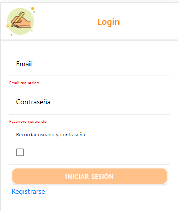
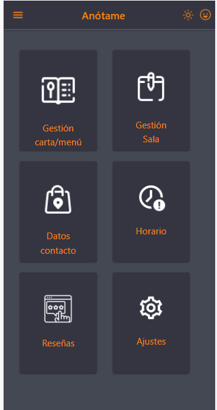
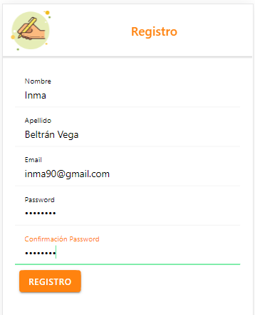
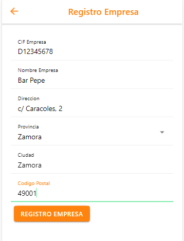
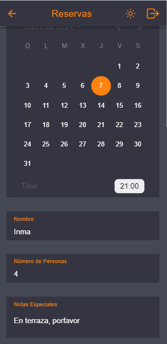
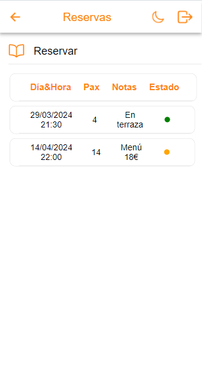
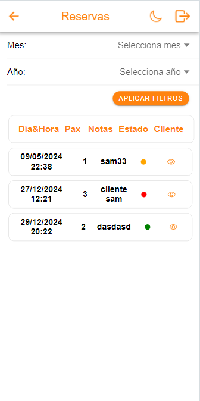
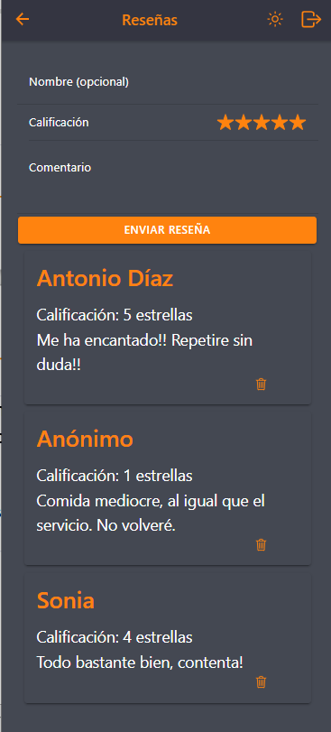

# Anótame

## Descripción

Anotame es una aplicación para la gestión de reservas, diseñada principalmente para bares y restaurantes. Esta herramienta permite a los establecimientos organizar sus reservas de manera eficiente y brindar un mejor servicio a sus clientes.

### Características para Restaurantes

- **Gestión de Trabajadores:** Permite agregar trabajadores con diferentes roles, como encargado o camarero.
- **Menú del Día:** Los restaurantes pueden subir el menú del día, indicando el día de la semana correspondiente.
- **Carta:** Posibilidad de subir la carta completa del establecimiento.
- **Descripción del Establecimiento:** Añade una descripción detallada del tipo de bar o restaurante que es.
- **Horarios:** Indica los horarios de apertura y cierre del establecimiento.
- **Registro de Empresa:** Los restaurantes deben registrar su empresa para utilizar la aplicación.
- **Gestión de Reservas en Tiempo Real:** Los establecimientos pueden ver las reservas en tiempo real mediante notificaciones y gestionar el estado de las mismas (aceptadas, pendientes o canceladas).

### Características para Clientes

- **Visualización de Menús:** Los clientes pueden ver los menús del día.
- **Carta:** Acceso a la carta completa del establecimiento.
- **Descripción del Local:** Los clientes pueden leer una descripción detallada del local.
- **Horarios:** Información sobre los horarios de apertura y cierre del establecimiento.
- **Reservas:** Los clientes pueden realizar reservas de manera sencilla a través de la aplicación.


## Capturas de Pantalla

Aquí puedes ver algunas capturas de pantalla de la aplicación:

### Carta

*Pantalla de visualización de la carta del establecimiento.*

### Login

*Pantalla de inicio de sesión.*

### Menú

*Visualización del menú principal.*

### Registro

*Pantalla de registro para nuevos usuarios.*

### Registro Empresa

*Pantalla de registro para empresas.*

### Reservas Cliente

*Pantalla de visualización de reservas para el cliente.*

### Reservas Cliente 2

*Segunda pantalla de visualización de reservas para el cliente.*

### Reservas Usuario

*Pantalla de visualización de reservas para el usuario.*

### Reseñas

*Pantalla de reseñas de los clientes.*

La **descripción completa** y **guía de uso** de la aplicación se encuentran más abajo en este documento. Por favor, revisa las secciones correspondientes para obtener información detallada sobre cómo funciona la aplicación y cómo utilizarla.

## Tabla de Contenidos
- [Instalación](#instalación)
- [Uso](#uso)
- [Capturas de Pantalla](#capturas-de-pantalla)
- [Funcionalidades](#funcionalidades)
- [Tecnologías Utilizadas](#tecnologías-utilizadas)
- [Contribuciones](#contribuciones)
- [Licencia](#licencia)
- [Contacto](#contacto)
### Instrucciones de Instalación

#### Requisitos Previos

- Node.js y npm:
  - Si no tienes Node.js instalado, descárgalo e instálalo desde [https://nodejs.org/](https://nodejs.org/).

#### Descarga del Proyecto

1. **Ubicación de la Carpeta del Proyecto:**
   - Asegúrate de que la carpeta del proyecto esté ubicada en la carpeta correspondiente del servidor local (por ejemplo, en la carpeta `htdocs` de XAMPP o la carpeta `www` de WampServer).

2. **Instalación de Dependencias:**
   - Abre la terminal en la carpeta del proyecto y ejecuta el siguiente comando para instalar las dependencias del proyecto:
     ```bash
     npm install
     ```

#### Sugerencia: Instalación Global de Herramientas de Desarrollo

- Si planeas trabajar con más proyectos en el futuro, puedes instalar Ionic CLI y Angular CLI globalmente. Ejecuta los siguientes comandos en la terminal:
  ```bash
  npm install -g @ionic/cli
  npm install -g @angular/cli

### Ejecución del Servidor de Desarrollo

Para iniciar el servidor de desarrollo de Ionic, ejecuta el siguiente comando:

```bash
ionic serve

La aplicación estará disponible en tu navegador en la dirección http://localhost:8100/ o en el puerto que hayas especificado.

###
Acceso a la Aplicación

Para acceder a la aplicación, abre tu navegador web y visita:

http://localhost:8100/inicio

###
Registro de Usuarios

Al crear una cuenta en la aplicación, asegúrate de que las contraseñas tengan al menos 6 caracteres y puedan incluir números, letras y caracteres especiales.

css
## Uso

### Registro y Gestión del Establecimiento por el Propietario/Administrador

1. **Registro del Propietario/Administrador:**
   - El propietario o administrador del establecimiento se registra en la aplicación proporcionando información personal y de contacto.

2. **Registro del Establecimiento:**
   - Una vez registrado, el propietario completa el registro del establecimiento proporcionando la información requerida.

3. **Registro de la Empresa:**
   - Después de registrar el establecimiento, se completa el registro de la empresa proporcionando la información básica.

4. **Inicio de Sesión del Propietario/Administrador:**
   - Tras completar el registro, el propietario o administrador puede iniciar sesión utilizando sus credenciales.

### Uso por Parte del Cliente

1. **Registro de Usuario:**
   - El cliente crea una cuenta proporcionando los detalles requeridos.

2. **Visualización de Menús:**
   - Explora los menús del día y la carta del restaurante.

3. **Descripción del Local:**
   - Lee la descripción del bar o restaurante y sus características.

4. **Horarios de Apertura:**
   - Consulta los horarios de apertura y cierre del establecimiento.

5. **Realización de Reservas:**
   - Utiliza la aplicación para realizar reservas con facilidad.

## Características

### Para el Propietario/Administrador del Establecimiento:

- **Gestión de Trabajadores:** Permite agregar trabajadores con roles específicos como encargado y camarero.
- **Gestión de Menús:** Subir menús del día y carta, indicando el día de la semana para los menús.
- **Descripción del Establecimiento:** Permite añadir una descripción del tipo de bar o restaurante, incluyendo datos de dirección y horarios de apertura.
- **Registro de la Empresa:** Facilita el registro de la empresa con información básica.
- **Gestión de Reservas:** Visualización en tiempo real de las reservas con notificaciones, capacidad para confirmar o cancelar reservas.

### Para el Cliente:

- **Visualización de Menús:** Acceso a los menús del día y la carta del restaurante.
- **Descripción del Local:** Información detallada sobre el tipo de bar o restaurante, dirección y horarios de apertura.
- **Realización de Reservas:** Capacidad para realizar reservas de forma intuitiva a través de la aplicación.

### Funcionalidades Adicionales:

- **Notificaciones en Tiempo Real:** Notificación instantánea al propietario/administrador cuando llega una nueva reserva.
- **Interfaz Intuitiva y Amigable:** Diseño fácil de usar tanto para propietarios como para clientes.
- **Modo Oscuro/Claro:** Opción para elegir entre modos de interfaz oscuro o claro para una mejor experiencia visual.
- **Seguridad de Datos:** Manejo seguro de la información personal y de reserva.

## Tecnologías Utilizadas

### Frontend:

- **Angular**: Framework de desarrollo de aplicaciones web basado en TypeScript.
- 
**Ionic Framework**: Plataforma de desarrollo de aplicaciones móviles y web utilizando tecnologías web estándar como HTML, CSS y JavaScript.
- 
**HTML/CSS**: Lenguajes fundamentales para la estructura y el diseño de páginas web.


### Backend:

- **CodeIgniter**: Framework de desarrollo web PHP de código abierto con un conjunto de bibliotecas para tareas comunes como manejo de bases de datos, autenticación, etc.
- 
**MySQL**: Sistema de gestión de bases de datos relacional utilizado para almacenar datos.

### Herramientas y Otros:

- 
**Node.js**: Entorno de ejecución de JavaScript del lado del servidor para construir aplicaciones de red rápidas y escalables.
- 
**npm**: Gestor de paquetes para JavaScript, utilizado para instalar y administrar dependencias.
- 
**Git**: Sistema de control de versiones para el seguimiento de cambios en el código fuente durante el desarrollo.
- 
**Visual Studio Code (VSCode)**: Editor de código fuente utilizado para desarrollar y depurar aplicaciones.
- **Postman**: Herramienta de colaboración para el desarrollo de APIs, que permite a los usuarios probar, documentar y compartir APIs.

## Contribuciones

¡Gracias por considerar contribuir a este proyecto! Las contribuciones son bienvenidas y apreciadas. A continuación, se presentan algunas directrices para ayudarte a contribuir de manera efectiva:

### Cómo Contribuir

1. 
**Fork del Repositorio**: Haz un fork del repositorio en GitHub y clona tu fork localmente:

   ```bash
   git clone https://github.com/beltrandev90/anotame.git
   cd anotame

2. 
**Crear una Rama**
Crea una nueva rama para trabajar en tu contribución:

git checkout -b feature/nueva-funcionalidad

3. **Realizar tus Cambios** Haz los cambios necesarios en el código.

4. 
**Commit de Cambios** Haz commit de tus cambios con un mensaje descriptivo:

git add .
git commit -m "Agrega nueva funcionalidad para ..."

5. 
**Subir los Cambios** Sube tus cambios a tu fork en GitHub:

git push origin feature/nueva-funcionalidad

6.
**Enviar un Pull Request**
Ve a tu repositorio en GitHub y crea un Pull Request para que tus cambios sean revisados e incorporados al proyecto principal.## Licencia

Este proyecto está licenciado bajo los términos de la [Licencia MIT](https://opensource.org/licenses/MIT).

### Resumen de la Licencia

- **Permisos:** Esta licencia permite a cualquier persona usar, copiar, modificar, fusionar, publicar, distribuir, sublicenciar y/o vender copias del software, bajo las siguientes condiciones.
  
- **Limitaciones:** Este software se proporciona "tal cual", sin garantía de ningún tipo, expresa o implícita.

- **Condiciones:** La licencia y los derechos de autor deben incluirse en todas las copias o partes sustanciales del software.

Para más detalles, consulta el archivo [LICENSE](./LICENSE) en este repositorio.
## Contacto

Si tienes alguna pregunta, sugerencia o simplemente quieres ponerte en contacto, puedes hacerlo a través de los siguientes medios:

- **Email**: [inma@beltrandev.com](mailto:inma@beltrandev.com)
- **GitHub**: [beltrandev90](https://github.com/beltrandev90)
- 
**Sitio Web**: [beltrandev.com](https://beltrandev.com/)
¡Esperamos saber de ti!
